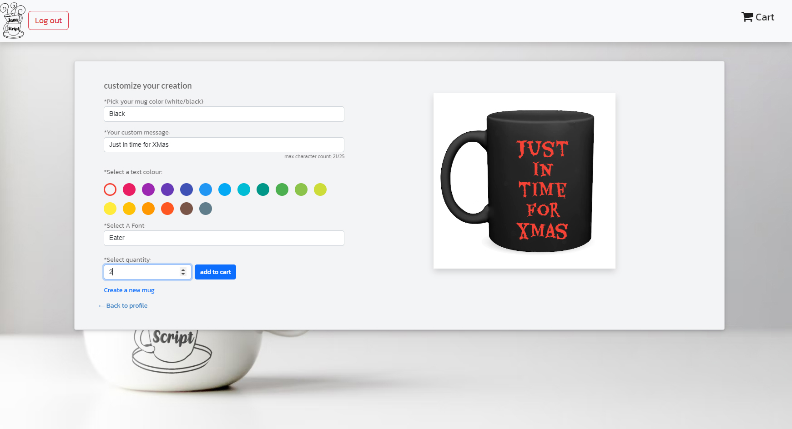

# Java Script

## Table of Contents

- [About this Project](#about-this-Project)
- [How to Shop](#how-to-shop)
- [Technologies Used](#Technologies-Used)
- [Credits](#credits)
- [License](#license)

## About This Project
Java script is e-commerce website where users can cstomize mugs with text and purchase them.

Customers can add custom text to a selection of different coloured mugs. The text can be different colours of different typefaces as chosen by the customer.

### How to Shop:

On landing, the customer is given the choice of customizng a mug or going to their profile where shipping information and previous orders can be seen.

When customizing a mug, there are inputs for text, colour of mug, typeface, colour of text, and quantity. Once all are chosen, the item can be added to the cart which generated the price. on checkout the Stripe integration takes over and processes the payment.

## Technologies Used:
1. React
2. MongoDB
3. GraphQL
4. Stripe
5. Heroku

## Usage

## Link:
- [Deployed Page](https://github.com/AmyWilford/Word-Play)
- [Github Repo](https://github.com/AmyWilford/Mug-Store)

## Installation
N/A

## Credits
Created as a collaboration of [Amy Wilford](https://github.com/AmyWilford), [Jaymen Laton](https://github.com/CanadianMRE), and [Saharsh Cherian](https://github.com/sashdc).

## License
MIT